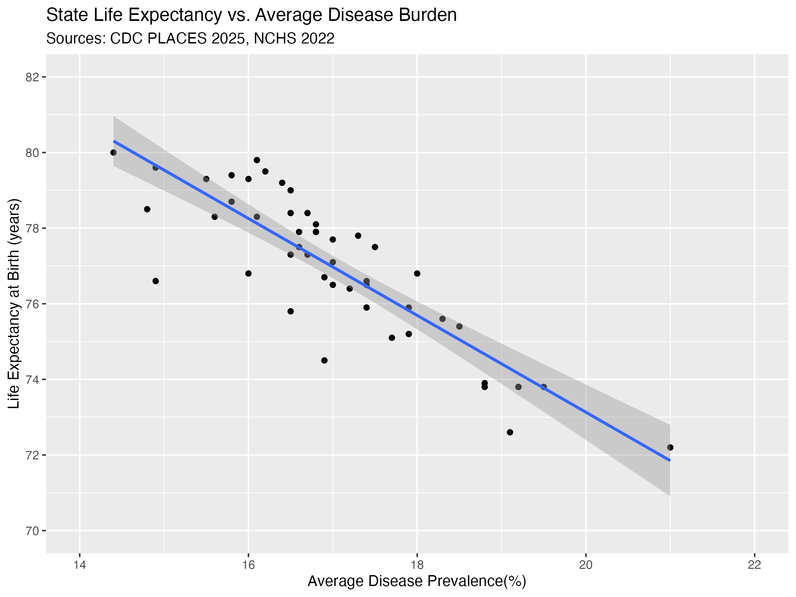
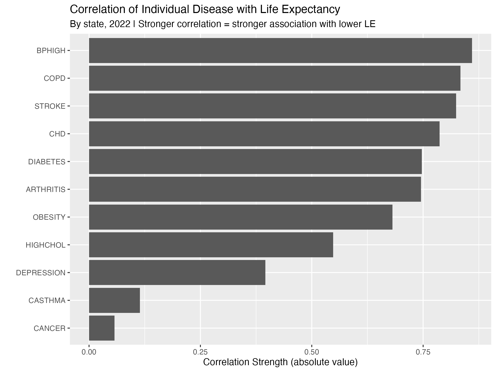
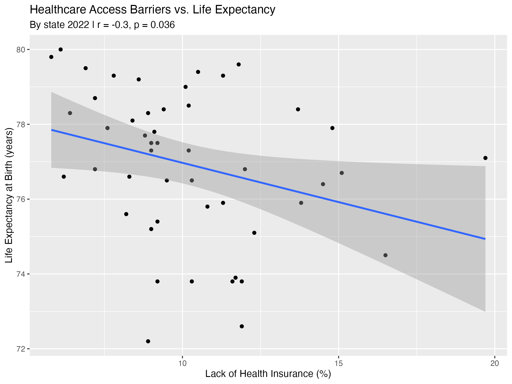
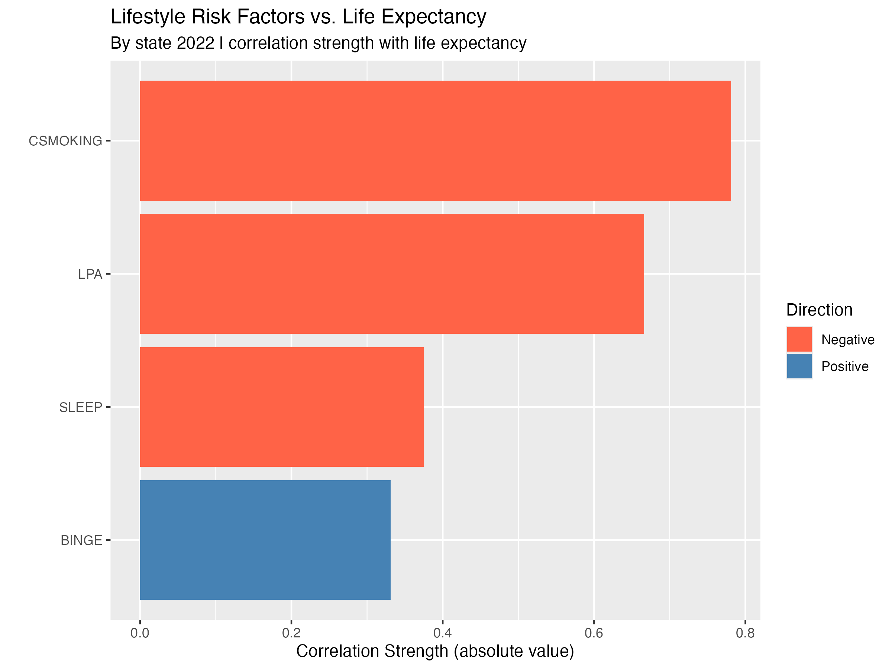
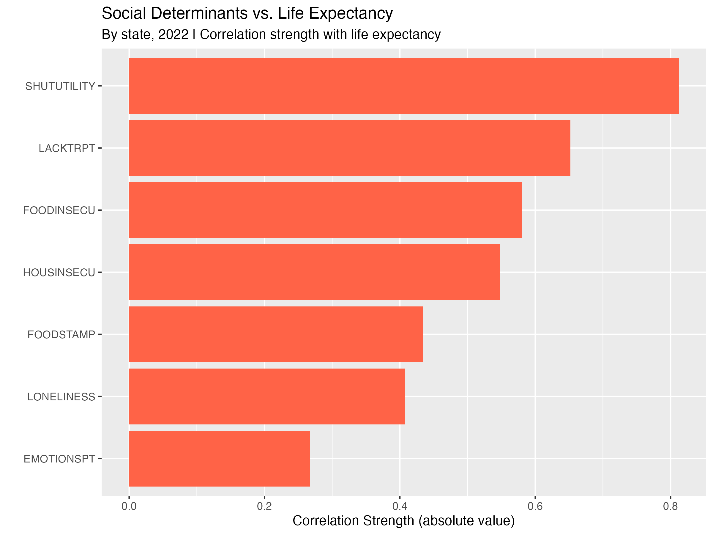
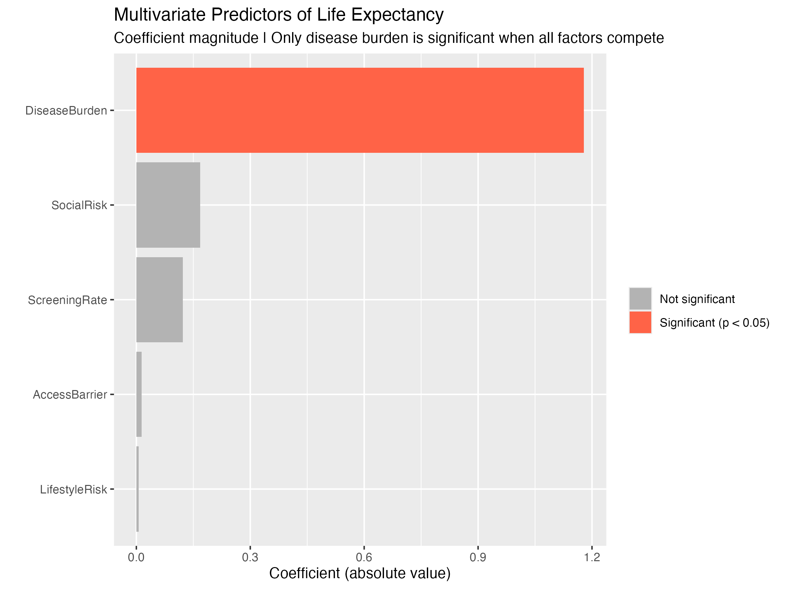
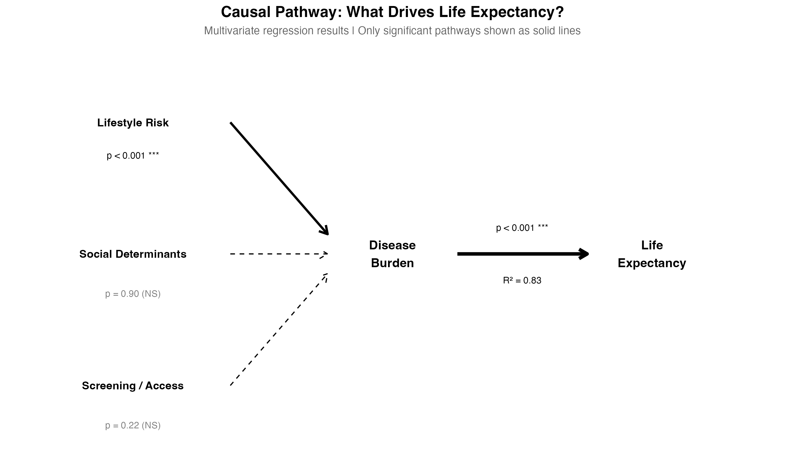

# The Geography of Chronic Disease and Life Expectancy in America

An analysis of how chronic disease prevalence relates to life expectancy across U.S. counties and states, using CDC PLACES and NCHS data.

## Project Overview
This project examines the relationship between chronic disease burden (diabetes, obesity, high blood pressure, high cholesterol, physical inactivity) and life expectancy at the county and state level across the United States. The goal is to identify geographic patterns, quantify risk factor contributions, and surface insights relevant to public health resource allocation.

## Q1: Does burden of disease predict life expectancy across states


**Finding:** Strong inverse correlation (r = -0.86, p < 0.001). Disease burden alone explains 73.5% of life expectancy variation across states. Each 1% increase in average disease prevalence is associated with a 1.28-year decrease in life expectancy.

## Q2: Which diseases have the greatest impact on life expectancy across states


**Finding:** High blood pressure is the strongest predictor of lower life expectancy (r = -0.86), followed by COPD (r = -0.83), stroke (r = -0.82), and coronary heart disease (r = -0.79). Cardiovascular and metabolic conditions dominate the top of the ranking. Cancer and asthma showed no statistically significant correlation with life expectancy (p > 0.05). All other disease correlations were statistically significant (p < 0.05).

## Q3: Do preventive screenings impact life expectancy?


**Finding:** Screening rates alone do not significantly predict life expectancy (r = 0.27, p = 0.062) or disease burden (r = -0.03, p = 0.84). However, access barriers (lack of health insurance) do significantly correlate with lower life expectancy (r = -0.30, p = 0.036). The barrier to healthcare matters more than the availability of screenings.

## Q4: Do lifestyle risk factors impact life expectancy?


**Finding:** Lifestyle risk significantly predicts both lower life expectancy (r = -0.64, p < 0.001) and higher disease burden (r = 0.67, p < 0.001). Smoking is the strongest individual lifestyle predictor (r = -0.78), followed by physical inactivity (r = -0.67). Binge drinking showed a counterintuitive positive correlation likely confounded by geography and wealth.

## Q5: Do social determinants impact life expectancy?


**Finding:** Social determinants significantly predict lower life expectancy (r = -0.58, p < 0.001). Threat of utility shutoff is the strongest individual social predictor (r = -0.81), serving as a powerful proxy for compounding economic disadvantage. Note: 9 states excluded due to missing social determinant data.

## Q6: What factors matter most when everything competes?



**Finding:** When disease burden, lifestyle risk, screening rate, access barriers, and social determinants are modeled together, only disease burden significantly predicts life expectancy (p < 0.001, R² = 0.83). A follow-up model confirms lifestyle risk is the only significant driver of disease burden (p < 0.001). Social determinants correlate strongly with both lifestyle risk (r = 0.55) and access barriers (r = 0.51), confirming that disadvantage compounds. The full causal chain: **social disadvantage → poor lifestyle + access barriers → disease burden → lower life expectancy.**

## Data Sources
| Dataset | Source | Level | Download |
|---------|--------|-------|----------|
| CDC PLACES (2025 release) | CDC/BRFSS | County | [data.cdc.gov](https://data.cdc.gov/500-Cities-Places/PLACES-County-Data-GIS-Friendly-Format-2024-releas/i46a-9kgh) |
| Life Expectancy by State & Sex (2018-2022) | NCHS | State | [cdc.gov](https://www.cdc.gov/nchs/data-visualization/state-life-expectancy/2022.htm) |
| USALEEP Life Expectancy (2010-2015) | NCHS | Census Tract | [data.cdc.gov](https://data.cdc.gov/National-Center-for-Health-Statistics/U-S-Life-Expectancy-at-Birth-by-State-and-Census-T/5h56-n989) |

> **Note:** Raw data files are not included in this repository due to size. See download links above to reproduce.

## Tools & Technologies

- **SQL** — Data extraction, transformation, and joins
- **R** — Statistical analysis, regression modeling, exploratory data analysis
- **Tableau** — Interactive dashboards ([Tableau Public link coming soon])

## Project Structure
```
├── data/
│   ├── raw/              # Original datasets
│   └── processed/        # Cleaned, joined data ready for analysis
├── sql/
│   └── *.sql             # Data transformation and exploration queries
├── analysis/
│   └── *.R               # R analysis done in Rstudio
├── visualizations/
│   ├── screenshots/      # Dashboard screenshots for README
│   └── *.twbx            # Tableau workbooks
├── docs/
│   └── data_dictionary.md
└── README.md
```

# Author
Brianna Foreman, 2026